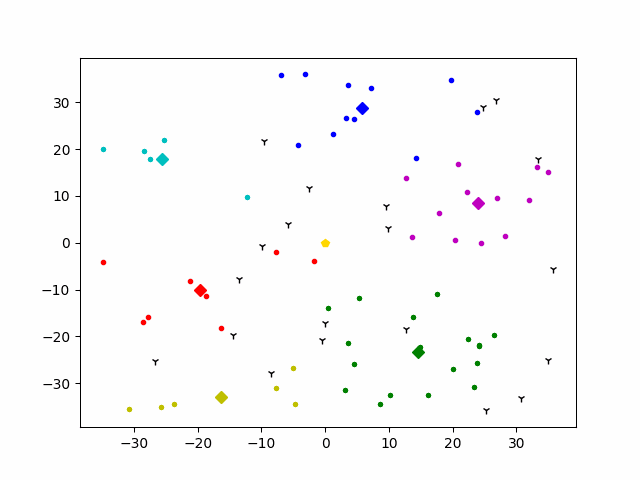

# drl

<!--  -->

### 实验环境

- Ubuntu 20.04
- python 3.8.10
- PyTorch 1.10.1
- OpenAI GYM 0.21.1
- PettingZoo(Gym for MARL) 1.11.0
- 墨子AI军事推演平台

### 运行方式

#### 单智能体深度强化学习算法

```python3
cd single_agent

python3 algo/ActorCritic.py
python3 algo/DDPG.py
python3 algo/DDQN.py
python3 algo/DQN.py
python3 algo/Dueling_dqn.py
python3 algo/ppo_lstm.py
python3 algo/PPO.py
python3 algo/REINFORCE.py
python3 algo/sac.py
```
or 
```python3
cd single_agent
python3 algo/train_all.py
```

详细说明见: single_agent/README.md

#### 多智能体深度强化学习算法MADDPG

```python3
cd multi_agents/MADDPG
python3 algo/main.py
```

#### 群智能体深度强化学习算法MFDDPG

```python3
cd scale_agents/mfddpg
```
可通过实例化train.py中的trainer类，进行算法调用。

具体案例实现见：https://github.com/ChangQingAAS/MFDDPG_Path_Planning
运行方式：python3 algo.py

### 实验结果

#### 单智能体深度强化学习算法


#### MADDPG算法


##### MFDDPG算法


